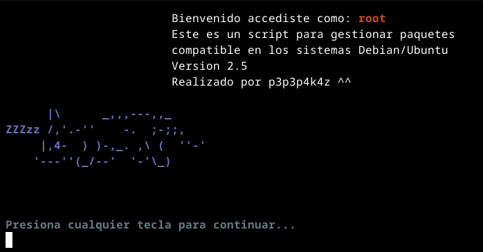

# script_linux

### ¿Qué es `script_linux`?
Este proyecto es un script de Bash diseñado para simplificar la instalación de paquetes en diversas distribuciones de Linux. Nació de la necesidad de automatizar la configuración de mis sistemas, especialmente después de reinstalar mi sistema operativo o en nuevas máquinas.

El script se ha probado y funciona mejor en:
* **Debian y distros derivadas:** Ubuntu, Linux Mint, Zorin OS, Pop!_OS.
* **Otras distros:** OpenSUSE y Fedora.

Espero que esta herramienta te sea tan útil como lo ha sido para mí, ahorrándote tiempo y esfuerzo en la configuración inicial de tu entorno de desarrollo.

### Funcionalidades principales
`script_linux` es un asistente de gestión e instalación de paquetes con las siguientes funciones:

* **Actualización** de paquetes del sistema.
* **Instalación** de paquetes específicos.
* **Eliminación** de paquetes.
* **Búsqueda** de paquetes en los repositorios.

---

### Paquetes pre-configurados
El script incluye opciones para instalar rápidamente tus herramientas de desarrollo favoritas:

* **Lenguajes de programación:** C/C++, Java 17, Python.
* **Herramientas de contenedores:** Docker.
* **Sistemas de paquetes alternativos:** Flatpak.
* **Compatibilidad:** Wine.
* **Entornos de desarrollo:** Varios IDEs populares.
* **Otros extras:** Herramientas y utilidades adicionales.

---

### ¿Cómo usarlo?
Para empezar a usar el script, simplemente clona este repositorio, abre tu terminal y ejecuta el comando `make run`.

```bash
make run
```

---



Por el momento no planeo agregar mas funcionalidades a este programa, mas que el de instalar paquetes o herramientas (ultimamente que encontrado buenas herramientas CLI en rust y dotfiles que podria añadir).

Este miniproyecto que solo me sirvio como practica para los conocimientos que adquiri sobre bash.